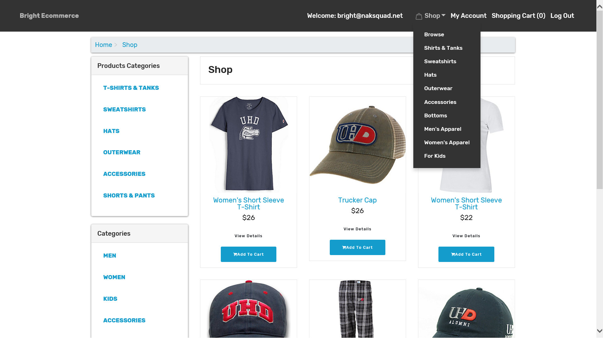
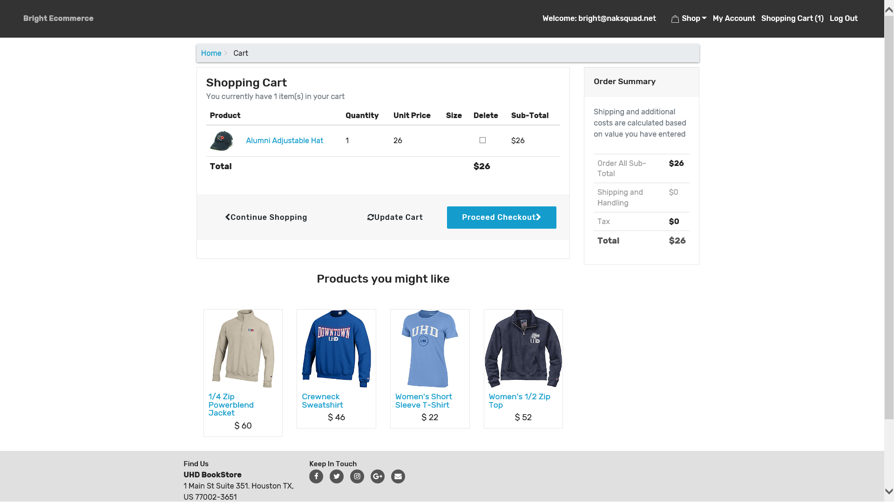
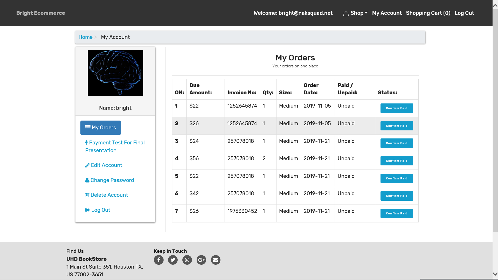
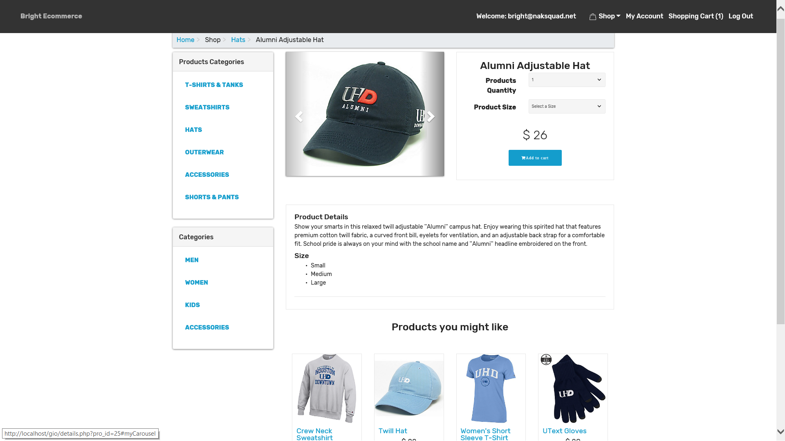
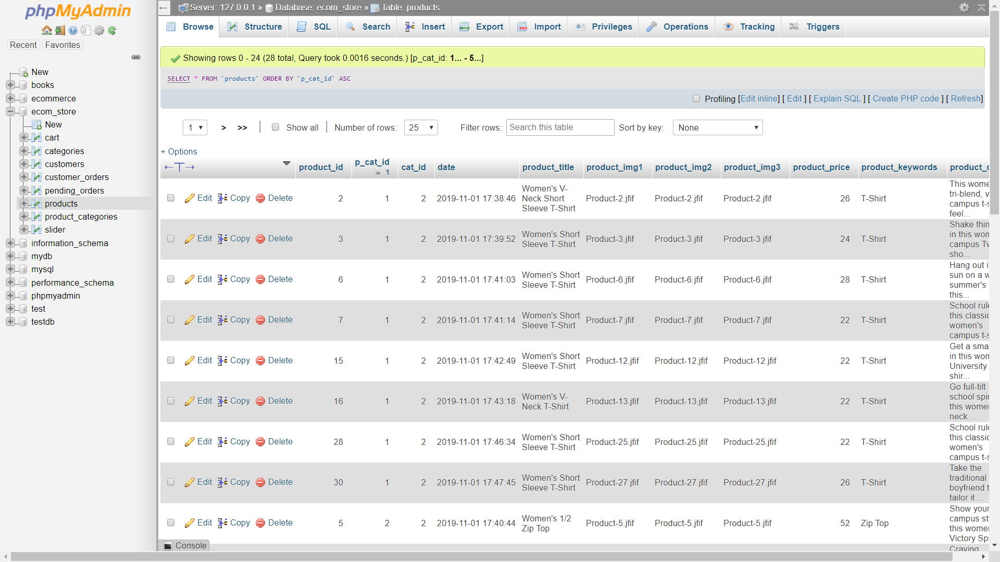

# ecommerce
Clothing Ecommerce Website
->  Enhanced Shopping Cart.
->  Admins/Clients areas.
->  Mobile-Friendly.
->  Content management system.
->  Email Marketing tools. 
->  Social media integration. 
->  Third-party Payment system/shipment integration.

## Page

